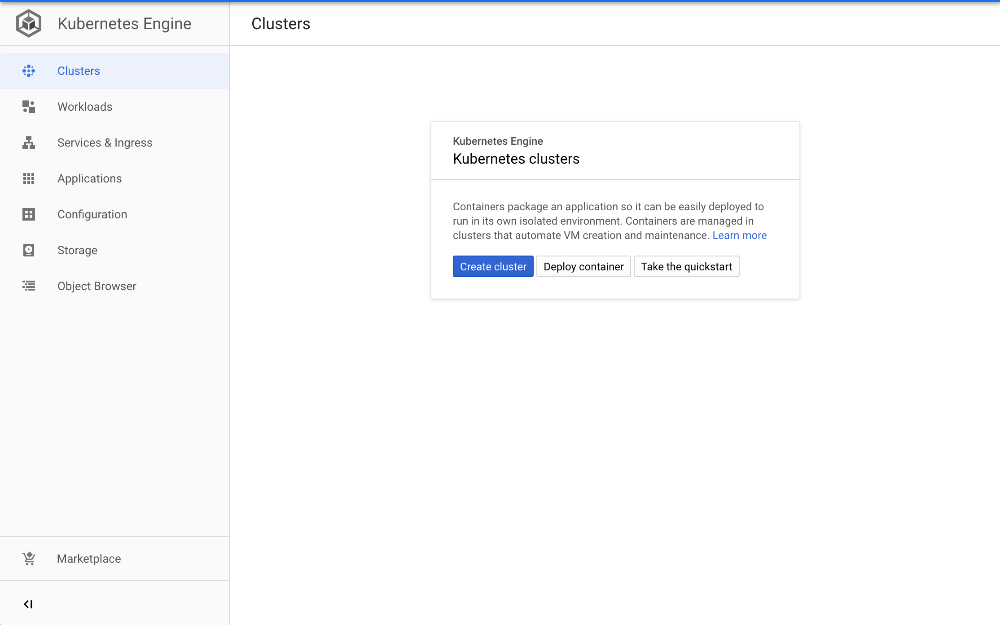
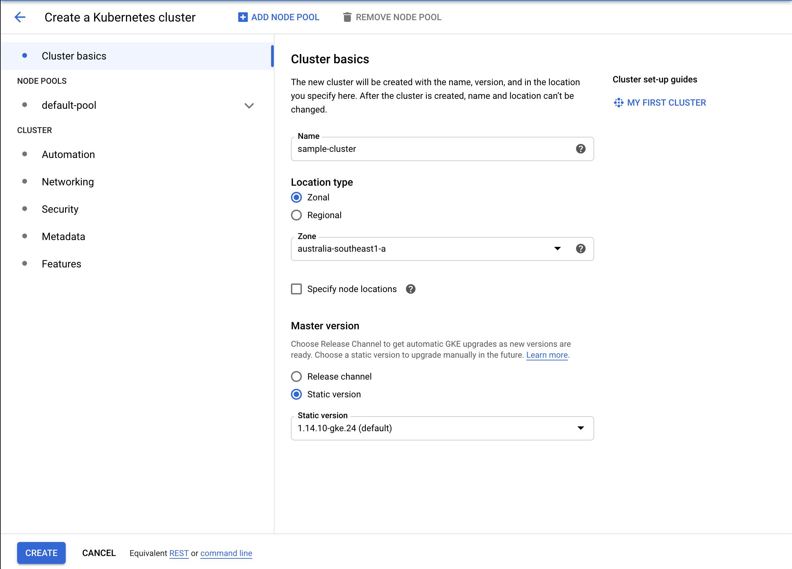

# An Atmail introduction to Kubernetes

Kubernetes is redefining how software is deployed and managed in a cloud-native era. For atmail we are researching how to roll out this technology to our cloud stack and how to support customers on using Kubernetes on-premise to manage and maintain highly available and fault-tolerant email systems.

The intention of this tutorial is to provide a brief history on Kubernetes, describe the fundamental aspects of the software, and how to deploy an example micro-service written in Golang which provides a `RBL` (real-time-blacklist) lookups for a specified IP address via a HTTP/JSON API. 

## What is Kubernetes

In a nutshell, Kubernetes provides a container orchestration platform to deploy multiple instances of an application across a collection of hardware nodes. Kubernetes supports automatic load-balancing, service discovery to route traffic, health monitoring and self-healing capabilities to insure services are online, scalable and operational. 

Kubernetes allows developers to deploy highly-available systems and provides a cloud vendor neutral approach to scale and deploy software at scale.


## History

The original authors of Kubernetes, Brendan Burns, Craig McLuckie & Joe Beda began development of the software in 2013 and in June 2014 the first release was announced. Since then, Kubernetes has grown to become the leading container orchestration platform and available on all major cloud platforms.

## How it works

To provide a simplified view of how Kubernetes works the components are broken down into:

### Nodes (Hardware)

A node is a single hardware instance configured to run within the Kubernetes cluster and abstracts the physical hardware characteristics to provide CPU and RAM resources for applications to run.

### Cluster

Kubernetes groups multiple hardware `nodes` into a cluster which is used to distribute applications. Additional hardware nodes can be added or removed, and the cluster will respond accordingly for available resources. 

### Volumes

Running applications within containers requires a new way to think of how you build and manage software, since disk-space within the container is not persistent, any data stored locally within the container will be destroyed on restart, and data is not available to be shared between instances.

As a solution Kubernetes provides storage volumes that can be shared and mounted between nodes within the cluster, such as a shared filesystem, storage volume, network storage, etc.

### Software

Kubernetes supports running software within Linux containers to deploy instances across the cluster - Simply define an existing container available on public registries such as Docker, or build your own software as a docker image which can be made available to run within Kubernetes.

Providing containerised applications unlocks multiple benefits for developers, from allowing software to be tightly defined and run on multiple environments, provide security to software running within their specific environment only, and the flexibility to test and publish software using CI/CD pipelines.

### Pods

Pods are the individual `workload` unit of Kubernetes, when a deployment is defined to run a specific container, Kubernetes will create pods that run the software within a cluster and distribute the number of defined replicas across available  nodes.

As load increases Kubernetes can be configured to automatically expand the number of available pods running a deployment, while Kubernetes will monitor individual pods for service health, and managing which pods in the pool are available to serve requests.

Pods are not managed individually rather are defined as a deployment.

### Deployments

A deployment defines the characteristics of an application to run, from the number of replicas, the image to execute, through to runtime settings such as environment variables or storage volumes to mount.

When a deployment is defined Kubernetes will launch the number of pods defined in the replica and setup individual networking and DNS between each individual pod.

### Services

Services provide the ability for a deployment to expose desired ports to an internal or external network and provides load-balancing between deployments and the available pods in a replica.

The service created through Kubernetes will take care of fail-over, load-balancing and redundancy.

### Ingress

Provides networking capabilities to expose ports to deployments and the cluster, similar to a service with additional flexibility. 

## Who supports Kubernetes

The big 3 cloud providers, Amazon AWS, Google Cloud Platform and Microsoft Azure support Kubernetes workloads and priced accordingly. 

Before choosing a cloud-provider for Kubernetes factor in the additional costs to run a Kubernetes cluster. Previously Google provided the Kubernetes cluster at no additional cost, however caused angst for developers in March 2020 by adding a service charge of $0.10 per hour for each Kubernetes cluster, while AWS charges $0.10 per/hour and Azure waives the fee.

Providers such as Digital Ocean provide competitive Kubernetes pricing and charge only for the number of hardware nodes used, without an additional fee for managing the Kubernetes cluster.

## Freedom

Kubernetes allows developers and system architects to design software and services that are cloud neutral - By providing infrastructure as code, from service definitions, deployments and configuration as code, it is easier to move from one cloud provider to another using Kubernetes and provide flexibility for your application work-loads between multiple cloud vendors.

# Tutorial

The tutorial will guide you through setting up a Kubernetes cluster on Google Cloud Platform `GCP` and deploy an example service to act as an IP-reputation service for email-traffic.

The example application `atmail-rbl` provides a HTTP server which provides a simple API to query an IP reputation against 4 public RBL services, Spamhaus, SenderScore, Barracuda RBL and Spamcop.

## Setting up a K8 cluster

If you do not already have a [GCP](https://cloud.google.com/) account signup and create an account and take advantage of the ~$200+ cloud credits.

Once an account is created login to the GCP console and create a cluster via the Kubernetes > Clusters page. 



Define a sample cluster name and select which zone you'd like the Kubernetes cluster deployment.

For this example we are using a cluster in the `australia-southeast1` zone, using region `australia-southeast1-a` with 3 individual nodes `n1-standard-1` instance types.



## Setup dependencies

The next step is to setup the command-line tool depedencies including the `gcloud` and `kubectl` tools. Follow the Google SDK guide for installation instructions.

[https://cloud.google.com/sdk/install](https://cloud.google.com/sdk/install)

## Compile atmail-rbl software

For illustration purposes as a common use-case for Atmail services, we will be building a lightweight micro-service to query multiple `RBL` servers for an IP's reputation via a HTTP interface.

The micro-service provides an example how to use Kubernetes within your environment as a use-case related to email-services.

Tutorial code, see `main.go`:

```golang
	// The 'crux' of the micro-service, allow to query an IP via a HTTP get
	r.GET("/query/:ip", func(c *gin.Context) {

		ip := net.ParseIP(c.Param("ip"))

		// RBL servers require the IP to be reversed as per the in-addr.arpa format
		reverseIP, err := ReverseIPAddress(ip)

		// Return an error if the input is malformed
		if err != nil {
			c.JSON(http.StatusInternalServerError, gin.H{"error": err.Error()})
			return
		}

		rblServers := strings.Split(rblHost, ",")

		// Build our JSON response
		var jsonResp []Resp
		jsonResp = make([]Resp, len(rblServers))

		// Loop through each query
		for i := range rblServers {

			// Query the reversed IP to the RBL host
			query := fmt.Sprintf("%s.%s.", reverseIP, rblServers[i])

			// Run the DNS query
			ips, err := net.LookupIP(query)

			// Append the output to our JSON object
			jsonResp[i].RblServer = rblServers[i]
			jsonResp[i].IPs = ips

			// Flag is the IP is matched on an RBL server
			if err != nil {
				jsonResp[i].IsMatch = false
			} else {
				jsonResp[i].IsMatch = true
			}

		}

		c.JSON(http.StatusOK, jsonResp)

	})
```

## Push software to Container Registry

Kubernetes runs software as Linux containers and requires a specified image to run within a deployment. 

For this tutorial we will use docker to bundle up an image and push the software to Google Container Registry `GCR` which supports private repositories out-of-the-box for Google Kubernetes.

To push the image run replace $PROJECT_NAME with your GCP project ID (available via the console):

```sh
PROJECT_ID=$PROJECT_NAME make docker
```

This will compile the `go` source-code within a docker image locally, and upload the completed image to Google Container Registry (GCR).

```
Building docker image (latest) and uploading to GCR ....
Successfully tagged atmail-rbl:latest
docker tag atmail-rbl gcr.io/$PROJECT_NAME/atmail-rbl:latest
docker push gcr.io/$PROJECT_NAME/atmail-rbl:latest
```

Once the image is successfully built, proceed to the next step.

## Connect to the cluster

The next step is to verify access to the newly created Kubernetes cluster, substitude the configuration variables with your environment below.

```sh
gcloud config set account $ADMIN_EMAIL
gcloud config set project $PROJECT_NAME
gcloud config set compute/region australia-southeast1
gcloud config set compute/zone australia-southeast1-a
gcloud container clusters get-credentials sample-cluster
```

Execute the following in your shell which will produce the following output

```
Updated property [core/account].
Updated property [core/project].
Updated property [compute/region].
Updated property [compute/zone].
Fetching cluster endpoint and auth data.
kubeconfig entry generated for sample-cluster.
```

## Verify authentication

Once configured you can verify authentication and the hardware nodes available via the Kubernetes cluster you created in step 1.

```bash
$ kubectl get nodes
NAME                                            STATUS   ROLES    AGE     VERSION
gke-sample-cluster-default-pool-fc0fce49-2hcp   Ready    <none>   7m35s   v1.14.10-gke.24
gke-sample-cluster-default-pool-fc0fce49-nt99   Ready    <none>   7m35s   v1.14.10-gke.24
gke-sample-cluster-default-pool-fc0fce49-p4fj   Ready    <none>   7m34s   v1.14.10-gke.24
```

This confirms the sample cluster is setup, authentication is successful, and returns the number of hardware nodes available.

## Setting up a deployment

The next step is to setup a sample deployment to run on the cluster. 

See the reference file at `./kubernetes/deployment.yaml` which describes the deployment:

```yaml
apiVersion: apps/v1
kind: Deployment
metadata:
  name: atmail-rbl-deployment
  labels:
    app: atmail-rbl
spec:
  replicas: 3
  selector:
    matchLabels:
      app: atmail-rbl
  template:
    metadata:
      labels:
        app: atmail-rbl
        lastupdate: "1553658806"
    spec:
      containers:
        - name: atmail-rbl-container
          image: gcr.io/$PROJECT_NAME/atmail-rbl:latest
          imagePullPolicy: Always
          env:
            - name: API_PORT
              value: "8001"
            - name: RBL_DNS_LOOKUP
              value: "zen.spamhaus.org,bl.score.senderscore.com,b.barracudacentral.org,bl.spamcop.net"
          ports:
            - containerPort: 8001
```

The configuration deployment describes `atmail-rbl` as an application, 3 replaces to be created across the Kubernetes cluster, and to pull the image from our Google Container Registry pushed in the previous step.

Kubernetes deployments embrace the (Twelve-Factor app principles)[https://12factor.net/] and encourages configuration settings to be via an environment variable, rather than a traditional configuration file on disk or read from a shared volume. In the example our deployment defines an API_PORT and RBL_DNS_LOOKUP via an environment variable that is parsed by the running service.

### Run deployment

The next step is to push the deployment to our newly created Kubernetes cluster and dispatch nodes to run our application.

```bash
kubectl apply -f ./kubenetes/deployment.yaml
```

To verify the changes:

```bash
$ kubectl get pods
NAME                                    READY   STATUS    RESTARTS   AGE
atmail-rbl-deployment-64d7d4477-cjqk9   1/1     Running   0          23s
atmail-rbl-deployment-64d7d4477-rcv6r   1/1     Running   0          23s
atmail-rbl-deployment-64d7d4477-snqmv   1/1     Running   0          23s
```

This returns 3 pods are running the `atmail-rbl` service and available for serving requests in the Kubernetes cluster.

## Setting up a service

Once a deployment is setup and pods available to take requests, a service must be exposed on the Kubernetes cluster to open specific port(s) on the WAN, and provide a load-balancer to serve and manage requests between available pods in the cluster.

For this example we will be exposing port 80 on the WAN:

```yaml
apiVersion: v1
kind: Service
metadata:
  name: atmail-rbl-service
  labels:
    app: atmail-rbl
spec:
  type: LoadBalancer
  ports:
    - port: 80
      targetPort: 8001
      protocol: TCP
  selector:
    app: atmail-rbl
```

The service.yaml describes which port to open on the WAN, the target-port of our deployment (pods) and which deployment to route requests.

To push changes run:

```bash
kubectl apply -f ./kubernetes/service.yaml
```

And query the service is active and it's allocated external-IP:

```bash
kubectl get services
NAME                 TYPE           CLUSTER-IP     EXTERNAL-IP     PORT(S)        AGE
atmail-rbl-service   LoadBalancer   10.124.6.152   35.244.123.47   80:32653/TCP   2m3s
```

## Query

Once the serivce is available with an external IP, you can query the service below:

Know spam IP:

```sh
curl http://35.244.123.47/query/177.69.19.49
```

Response:
```json
[{
    "RblServer": "zen.spamhaus.org",
    "IsMatch": false,
    "IPs": null
}, {
    "RblServer": "bl.score.senderscore.com",
    "IsMatch": true,
    "IPs": ["127.0.0.2"]
}, {
    "RblServer": "b.barracudacentral.org",
    "IsMatch": true,
    "IPs": ["127.0.0.2"]
}, {
    "RblServer": "bl.spamcop.net",
    "IsMatch": true,
    "IPs": ["127.0.0.2"]
}]
```

Congratulations, the example atmail-RBL service is successfully running on your Kubernetes cluster with 3 nodes across 3 individual hardware nodes. As an example, the atmail-rbl Kubernetes service could be used within your email-infrastructure to scan incoming IP connections for known spam, or integration with a custom anti-spam service to inspect `Received` headers in email-messages.

# Conclusion

Kubernetes is redefining how modern software is run and deployment in a cloud-native era.

Kubernetes provides developers and system-administrators a powerful framework to manage, run and maintain software. Kubernetes provides freedom through a neutral cloud vendor approach, allowing you to deploy the same software on-premise, or within AWS, GCP or Azure with ease.
